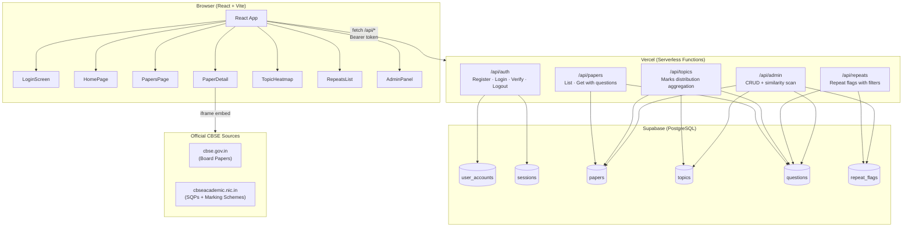
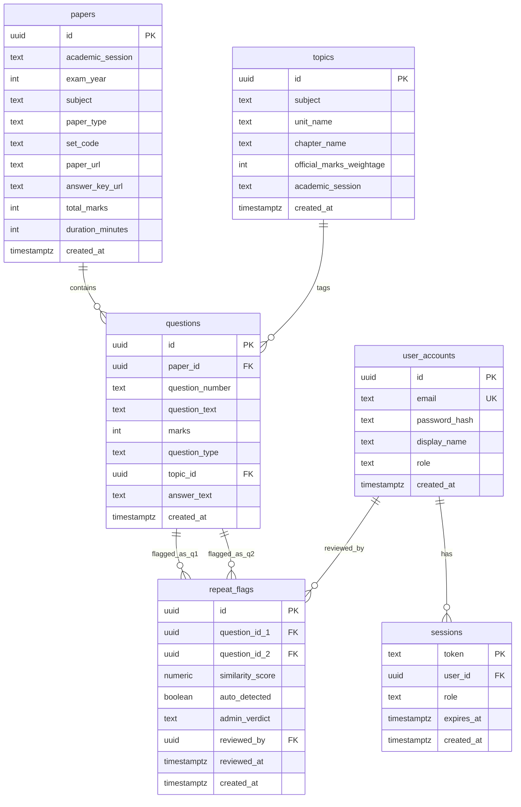
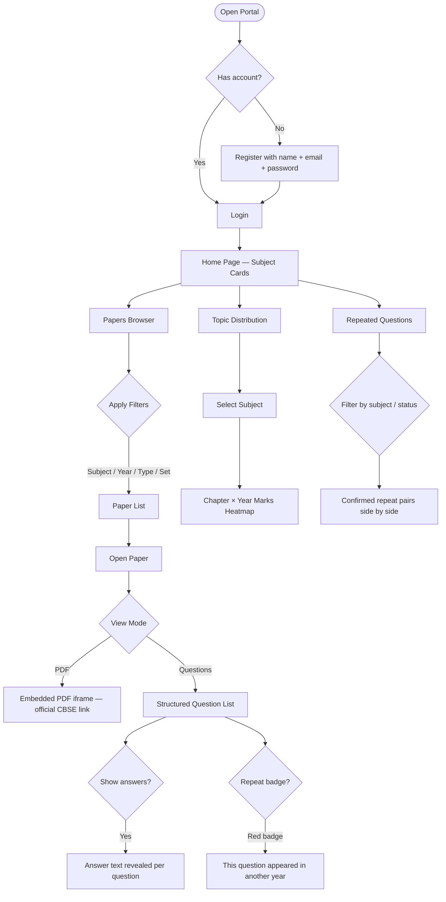
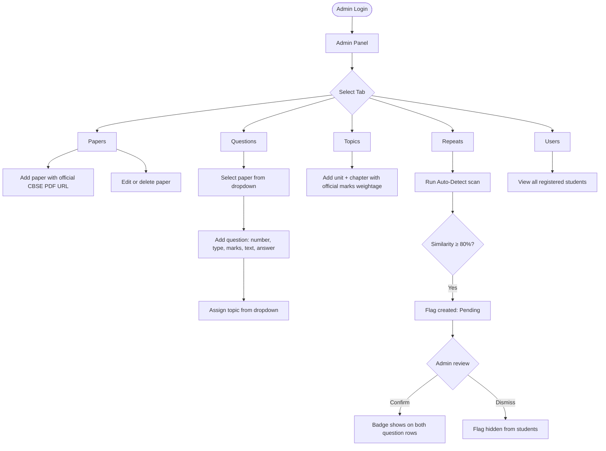
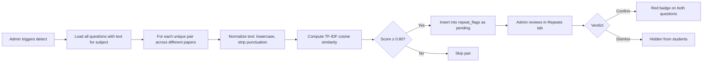

# CBSE Class 12 Science — Answer Validation Portal

> A student portal for Class 12 CBSE Science stream students to browse official past question papers, marking schemes, topic-wise distributions, and algorithmically detected repeated questions — powered by React, Vercel, and Supabase.

**Live App:** [cbse-answer-validation.vercel.app](https://cbse-answer-validation.vercel.app)

---

## Table of Contents

- [Overview](#overview)
- [Features](#features)
- [Architecture](#architecture)
- [Data Model](#data-model)
- [API Reference](#api-reference)
- [User Flows](#user-flows)
- [Repeat Detection Logic](#repeat-detection-logic)
- [Getting Started (Local Dev)](#getting-started-local-dev)
- [Deployment](#deployment)
- [Data Scope](#data-scope)
- [Admin Guide](#admin-guide)

---

## Overview

This portal provides Class 12 CBSE Science stream students with structured access to:
- Official past question papers and marking schemes (2020–2024, excluding 2021)
- Four subjects: **Physics**, **Chemistry**, **Mathematics**, **Computer Science**
- Topic-wise marks distribution heatmap per year
- Algorithmically detected repeated questions (≥80% text similarity), confirmed by admin

All content links strictly to official CBSE sources: `cbse.gov.in` and `cbseacademic.nic.in`.

---

## Features

| Feature | Description |
|---|---|
| **Student Auth** | Register/login with email + password; 30-day session tokens |
| **Papers Browser** | Filter by subject, year, paper type (Board/SQP), set code |
| **Hybrid Paper View** | PDF iframe (official CBSE link) + structured question list with toggle |
| **Answer Key Toggle** | Students can show/hide extracted answer text per question |
| **Topic Heatmap** | Chapter × Year marks table with colour-coded heat scale |
| **Repeated Questions** | Questions appearing across years flagged by text similarity |
| **Admin Panel** | Full CRUD for papers, questions, topics; repeat flag review |
| **Auto-Detection** | On-demand cosine similarity scan to find repeated questions |
| **Dark Mode** | Full dark/light theme with CSS custom properties |

---

## Architecture



---

## Data Model



---

## API Reference

### Auth — `/api/auth`

| Method | Action | Description |
|---|---|---|
| `POST` | `{ action: "register" }` | Create student account, returns token |
| `POST` | `{ action: "login" }` | Verify credentials, returns token |
| `GET` | — | Verify Bearer token, returns role + name |
| `DELETE` | — | Logout, deletes session |

### Papers — `/api/papers`

| Method | Query Params | Description |
|---|---|---|
| `GET` | `subject, year, type, set` | List papers with filters |
| `GET` | `id=<uuid>` | Get single paper with all questions + repeat flags |

### Topics — `/api/topics`

| Method | Query Params | Description |
|---|---|---|
| `GET` | `subject` | Marks distribution aggregated by chapter × year |

### Repeats — `/api/repeats`

| Method | Query Params | Description |
|---|---|---|
| `GET` | `subject, verdict` | List repeat flag pairs (pending/confirmed/dismissed) |

### Admin — `/api/admin` *(requires admin role)*

| Method | `?action=` | Description |
|---|---|---|
| `PUT` | `paper` | Add or update paper metadata |
| `DELETE` | `paper&id=` | Delete a paper |
| `POST` | `question` | Add question to a paper |
| `PUT` | `question&id=` | Update question topic/answer |
| `DELETE` | `question&id=` | Delete question |
| `PUT` | `repeat&id=` | Confirm or dismiss a repeat flag |
| `POST` | `detect` | Run cosine similarity scan (subject optional) |
| `GET` | `papers` | List all papers for admin table |
| `GET` | `topics` | List all topics |
| `PUT` | `topic` | Add or update topic |
| `GET` | `users` | List all registered users |

---

## User Flows

### Student Journey



### Admin Workflow



---

## Repeat Detection Logic



**Algorithm details:**
- Uses `natural` npm package (TF-IDF + cosine similarity)
- Text normalized: lowercase, punctuation stripped, whitespace collapsed
- Pairs with `paper_id` matching are skipped (same paper)
- Duplicate pairs are skipped via `ON CONFLICT DO NOTHING`
- Runs on-demand from Admin Panel only (not on every request)

---

## Getting Started (Local Dev)

### Prerequisites
- Node.js 18+
- A Supabase project
- Git

### 1. Clone the repo

```bash
git clone https://github.com/monojsaha/cbse-answer-validation.git
cd cbse-answer-validation
```

### 2. Install dependencies

```bash
npm install
```

### 3. Set up Supabase

Run `supabase-setup.sql` in your Supabase SQL editor:
> Dashboard → SQL Editor → New query → paste + run

### 4. Configure environment

Create a `.env` file:

```env
SUPABASE_URL=https://your-project.supabase.co
SUPABASE_SERVICE_KEY=your-service-role-key
```

### 5. Create your first admin user

In the Supabase Table Editor, open `user_accounts` and insert:

| field | value |
|---|---|
| email | your@email.com |
| password_hash | run `node -e "require('bcryptjs').hash('yourpass',10).then(console.log)"` |
| display_name | Admin |
| role | admin |

### 6. Run locally

```bash
npm run dev
```

For API routes to work locally, use Vercel CLI:

```bash
npx vercel dev
```

Open [http://localhost:3000](http://localhost:3000)

---

## Deployment

This project deploys automatically to Vercel on every push to `main`.

### Manual deploy

```bash
npx vercel --prod
```

### Required environment variables (Vercel Dashboard)

| Key | Description |
|---|---|
| `SUPABASE_URL` | Your Supabase project URL |
| `SUPABASE_SERVICE_KEY` | Service role key (server-side only, bypasses RLS) |

---

## Data Scope

| Academic Year | Calendar Year | Paper Format | Included |
|---|---|---|---|
| 2019-20 | 2020 | Standard board exam | Yes |
| 2020-21 | 2021 | Exams cancelled by CBSE | **No** |
| 2021-22 Term 1 | Nov 2021 | MCQ-only (COVID format) | Yes |
| 2021-22 Term 2 | May 2022 | Subjective (COVID format) | Yes |
| 2022-23 | 2023 | Full board, Set 1/2/3 | Yes |
| 2023-24 | 2024 | Full board, Set 1/2/3 | Yes |

**Subjects:** Physics (042), Chemistry (043), Mathematics (041), Computer Science (083)

**Paper types:**
- `board` — Actual CBSE board exam paper from `cbse.gov.in`
- `sqp` — Sample Question Paper from `cbseacademic.nic.in` (released at start of session with official marking scheme)

---

## Admin Guide

### Adding a Paper

1. Log in as admin → **Admin Panel** → **Papers** tab
2. Click **Add Paper**
3. Fill in:
   - Subject, Academic Session, Exam Year
   - Paper Type (Board / SQP), Set Code
   - Total Marks, Duration
   - **Paper URL** — official CBSE PDF link (from `cbse.gov.in` or `cbseacademic.nic.in`)
   - **Marking Scheme URL** — official answer key PDF link
4. Save

### Adding Questions

1. **Admin Panel** → **Questions** tab
2. Select a paper from the dropdown
3. Click **Add Question** for each question:
   - Question number (e.g. `1`, `2a`, `15(b)`)
   - Type: MCQ / Short Answer / Long Answer / Case Based / Assertion-Reason
   - Marks
   - Topic (from dropdown — add topics first)
   - Question text (paste extracted text from PDF)
   - Answer key points (paste from marking scheme)

### Setting Up Topics

1. **Admin Panel** → **Topics** tab
2. Add each chapter:
   - Subject, Unit Name, Chapter Name
   - Official marks weightage (from CBSE syllabus PDF)
   - Academic session

> Tip: Set up all topics before adding questions so they appear in the dropdown.

### Detecting Repeated Questions

1. **Admin Panel** → **Repeats** tab (or **Repeated Questions** nav link)
2. Optionally select a subject
3. Click **Run Auto-Detect**
4. Review flagged pairs — click **Confirm** (shows red badge to students) or **Dismiss**

---

## Tech Stack

| Layer | Technology |
|---|---|
| Frontend | React 18, Vite 5, CSS Custom Properties |
| Icons | lucide-react |
| Backend | Vercel Serverless Functions (Node.js CommonJS) |
| Database | Supabase (PostgreSQL with RLS) |
| Auth | Custom UUID tokens + bcryptjs |
| NLP | `natural` (TF-IDF cosine similarity) |
| PDF Viewing | Native `<iframe>` embedding official CBSE PDFs |
| Deployment | Vercel (auto-deploy from GitHub main) |

---

## License

For educational use. All question papers and marking schemes are property of CBSE and linked from official government sources only.
